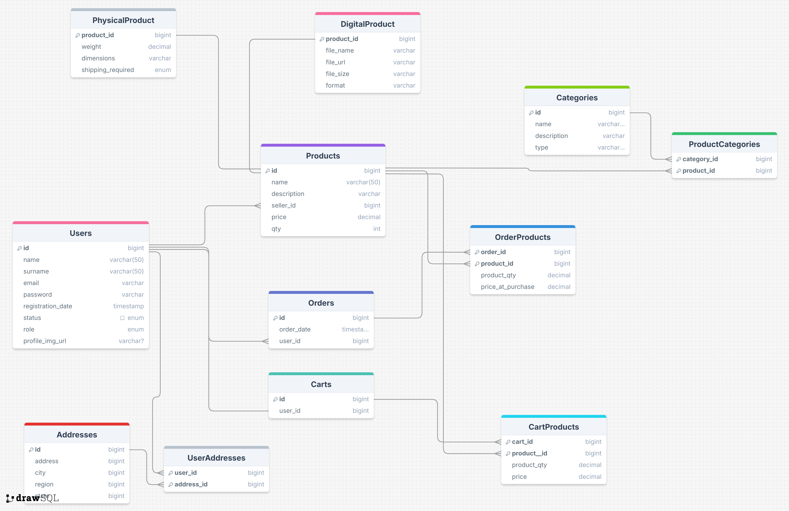

# Project Overview

Tipologia di Progetto: E-commerce

Tipologie di Utenti:

- Customers
- Sellers
- Administrator

Informazioni sui prodotti:

- Costo
- Quantità a Magazzino
- Chi lo vende
- Categorie di cui fa parte

## Customers’ Point of View:

- Visualizzazione dei prodotti disponibili
- Scelta di uno o più prodotti → vengono inseriti nel carrello
- Visualizzazione dei prodotti nel carrello
- Acquisto dei prodotti presenti nel carrello → creazione di un ordine
- Visualizzazione degli ordini effettuati
- Visualizzazione dei prodotti presenti negli ordini effettuati

## Sellers’ Point of View

- Creazione di un nuovo prodotto
- Modifica di un prodotto
- Eliminazione di un prodotto → solo se non ci sono ordini associati
- Visualizzazione dei propri prodotti
- Visualizzazione unità totali vendute per prodotto

## Administrator’s Point of View

- Gestione degli utenti:
    - Visualizzazione
    - Modifica
    - Eliminazione → solo se non ci sono ordini attivi

## Funzionalità Aggiuntive

- Gestione degli errori
- Gestione delle password
- Gestione dell’autenticazione con JWT
- Gestione delle autorizzazioni
- Creazione di Query dove necessario
- Creazione di endpoint dedicato alla registrazione → se nuovo utente allora viene inviata una mail di avvenuta registrazione
- L’utente avrà la possibilità di gestire una propria immagine del profilo

## Entità Finali

1. Users → Gestione delle varie entità con ereditarietà
2. Products
3. Orders
4. Carts
5. Categories
6. Addresses
7. Order_Products
8. Cart_Products

## Diagramma ER

## Environment Variables
### DATABASE
- DB_NAME = nome del databse
- DB_USERNAME = username che può accedere a quel database
- DB_PASSWORD= password dell'utente che può accedere al db
### JWT
- JWT_SECRET = password impostata per JWT
### MAILGUN
- MAILGUN_DOMAIN = dominio di mailgun
- MAILGUN_API_KEY = api key
- MAILGUN_SENDER = sender delle mail
### CLOUDINARY
- CLOUDINARY_NAME = nome fornito da cloudinary
- CLOUDINARY_KEY = api key
- CLOUDINARY_SECRET = api secret

## Project Specifications
- Il programma si basa su un database di tipo postgres
- La tipologia di gestione del database è update
- Il programma ad ogni registrazione di un utente, grazie a mailgun invierà un email
- L'utente, con endpoint dedicato e grazie alle api cloudinary sarà in grado di gestire una propria immagine del profilo, ma solo dopo che si sarà registrato

## How to Run the Project

### Requirements
- Java 21+
- Maven
- PostgreSQL

### Setup
1. Create a PostgreSQL database
2. Configure environment variables as described above

## Main API Endpoints

### Auth
- POST /auth/login
- POST /auth/register

### Users
- GET /users (admin)
- PUT /users/{id} (admin or owner)
- DELETE /users/{id} (admin or owner)
- PATCH /users/{id}/profile-picture (admin or owner)
- POST /users/addresses
- PUT /users/addresses/{id}
- DELETE /users/addresses/{id}
- GET /users/me/carts (customer)
- POST /users/me/carts (customer)
- PUT /users/me/carts/items/{productId} (customer)
- DELETE /users/me/carts/items/{productId} (customer)
- GET /users/me/carts/items (customer)

### Products
- GET /products
- GET /prdoucts/{id}
- GET /products/statistics (seller)
- POST /products/digital-products (seller)
- POST /products/physical-products (seller)
- POST /products/{productId}/categories/{categoryId} (seller)
- PUT /products/digital-products/{Id} (seller)
- PUT /products/physical-products/{Id} (seller)
- DELETE /products/{id} (seller)
- DELETE /products/{productId}/categories/{categoryId} (seller)

### Categories
- GET /categories (admin)
- GET /categories/{id} (admin)
- POST /categories (admin)
- PUT /categories/{id} (admin)
- DELETE /categories/{id} (admin)

### Orders
- GET /orders (customer)
- GET /orders/{id} (customer)
- POST /orders  (customer)
